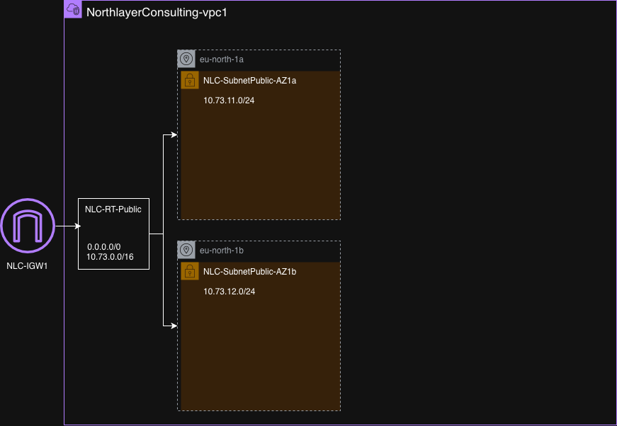

# Northlayer Consulting - AWS Network Lab

## Objective

The fictional company Northlayer Consulting requires a network foundation in AWS.
The purpose is to practice AWS Networking concepts.

## What I created

- VPC: `NorthlayerConsulting-vpc1`
- Region: `eu-north-1`
- Ipv4 CIDR: `10.73.0.0/16`
- Created an Internet Gateway `NLC-IGW1` and attached it to `NorthlayerConsulting-vpc1`
- Created route table `NLC-RT-Public`, added the default internet route to `NLC-IGW1` and associated both public subnets

| Destination | Target |
|-------------|--------|
| 10.73.0.0/16 | local |
| 0.0.0.0/0 | NLC-IGW |

The local route handles traffic within the VPC and the default route send traffic to destinations outside the VPC via the internet gateway.

  ## At this stage it looks like this

Subnet intended for public access: 

- Public subnet 1 in `eu-north-1a` AZ: `NLC-SubnetPublic-AZ1a`, `10.73.11.0/24`
- Public subnet 2 in `eu-north-1b` AZ: `NLC-SubnetPublic-AZ1b`, `10.73.12.0/24`

## EC2 web server

- Launched an Amazon Linux 2023 Instance named `NLC-Web-01` in `NLC-SubnetPublic-AZ1a`
- Attached the security group `NLC-SG-Web` which allows HTTP from the internet and SSH from my public IP
- Connected over SSH, installed Apache and created a simple webpage, enabled Apache to start automatically after a reboot

## Verification

I opened the instance's public IPv4 address in my browser
using HTTP and confirmed that the Northlayer Consulting
webpage loaded.

## Naming convention

I used a consistent naming convention to identify the resources

Example: `NLC-SubnetPublic-AZ1a`

| Company | Resource and purpose | Availability Zone |
|---------|----------------------|-------------------|
| NLC     | SubnetPublic         | AZ1a              |

